<div align="center">


# Serial Port Utility

**Serial, TCP and UDP in one window — up to 16 ports at once, with a transparent bridge between any two of them.**

[](https://github.com/alithon/serial-port-utility/releases/latest)
[](https://github.com/alithon/serial-port-utility/releases)
[](#download)
[](https://alithon.com)

[Download](https://github.com/alithon/serial-port-utility/releases/latest) ·
[Documentation](https://alithon.com/docs) ·
[Changelog](https://github.com/alithon/serial-port-utility/releases) ·
[Website](https://alithon.com) ·
[中文说明](README.zh-CN.md)

</div>

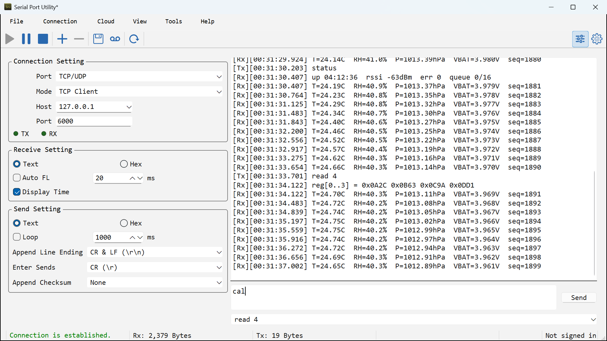

## What it is

Serial Port Utility (SPU, Chinese name 友善串口调试助手) is a desktop terminal for the everyday
work of firmware, embedded, IoT and industrial engineers: open a port, see exactly what the
device is sending, send commands or raw frames back, and keep a timestamped record of the
whole session.

It is a commercial application from [Alithon Studio](https://alithon.com), shipping on
Windows, macOS and Linux, with a 30-day free trial. **This repository is the official home
of its binary releases** — see [About this repository](#about-this-repository).

What sets it apart from a plain terminal emulator:

- **One window for the whole bench.** Serial, TCP client/server and UDP client/server
  connections live side by side — up to 16 — each with its own format, encoding,
  timestamps and log file.
- **A bridge, not just a viewer.** Forward bytes between any two connections, so a serial
  device becomes reachable over the network — *while both directions stay on screen*.
- **Protocol work built in.** Modbus RTU/ASCII request builder, a CRC library that can be
  appended to what you send, RFC 2217 and a Modbus TCP ⇄ RTU gateway.
- **Sessions you can reopen.** Save the whole workspace as a `.spu` file and pick the bench
  back up tomorrow exactly as you left it.

## Download

| Platform | File | Requirements |
| --- | --- | --- |
| **Windows** | `serial_port_utility_<version>_<MMdd>.exe` — installer | Windows 10 version 1809 (build 17763) or later, 64-bit |
| **macOS** | `SerialPortUtility-v<version>.dmg` | macOS 12 Monterey or later, **Apple Silicon** |
| **Linux** | `serial-port-utility-v<version>-linux-x86_64.tar.gz` | x86_64, glibc 2.35+ (Ubuntu 22.04 and later), Qt 6.8 runtime |

**[⬇ Get the latest release](https://github.com/alithon/serial-port-utility/releases/latest)**

Downloads are also served from [alithon.com/downloads](https://alithon.com/downloads), which
lists the SHA-256 of every build — worth checking whichever mirror you use.

<details>
<summary><b>Notes per platform</b></summary>

**Windows** — run the installer and follow the prompts. Installing over an existing copy keeps
your settings and license.

**macOS** — the `.dmg` published here is not notarized by Apple. macOS will refuse the first
launch; open **System Settings → Privacy & Security** and choose **Open Anyway**, or clear the
quarantine flag yourself:

```bash
xattr -dr com.apple.quarantine /Applications/SerialPortUtility.app
```

**Linux** — the archive holds a dynamically linked binary, so install the Qt 6.8 runtime first
(Qt Widgets, Network, SerialPort and Core5Compat). On Debian or Ubuntu:

```bash
sudo apt install qt6-base-dev qt6-serialport-dev qt6-5compat-dev
tar xzf serial-port-utility-*-linux-x86_64.tar.gz
./SerialPortUtility
```

Accessing a serial port normally requires membership of the `dialout` group:
`sudo usermod -aG dialout $USER` (log out and back in).

</details>

## Highlights

### Serial, TCP and UDP — side by side

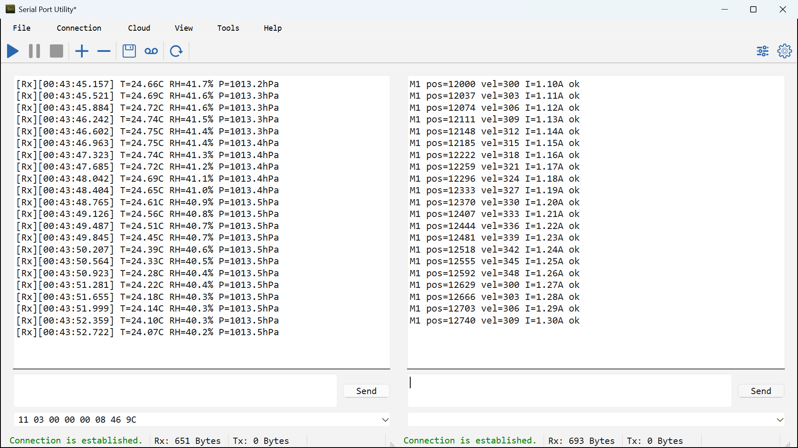

- Any COM port: built-in ports, USB-to-serial adapters (FTDI, Prolific, CH340, CP210x…) and
  virtual ports.
- Standard baud rates plus any custom rate your hardware can generate; 5/6/7/8 data bits;
  None/Even/Odd/Mark/Space parity; 1/1.5/2 stop bits; None, RTS/CTS or XON/XOFF flow control.
- Change any of them while the port is open and the change lands on the port in place — no
  close-and-reopen, so DTR stays up and the board on the other end is not reset.
- Live TX/RX and control-line lamps (RTS, CTS, DTR, DSR, DCD, RI) that blink with real
  traffic; DTR and RTS can be toggled by hand.
- TCP client, TCP server (multi-client), UDP client and UDP server for network-attached
  devices, serial-to-Ethernet gateways and simulators.
- Up to 16 connections in one window, arranged horizontally, vertically or in a grid — and
  the boundary between them can be dragged, so a chatty port gets more room.
- Automatic reconnection after an unexpected disconnect.

### Five ways to reach a port that is somewhere else

Working on a remote serial device is not one problem. Picking the wrong path usually costs you
either *connected, but the baud rate cannot be changed* or *the network never reaches the site
at all*. Serial Port Utility ships all five paths; what separates them is **which end opens
the connection**, **whether serial parameters travel with the data**, and **what the far end
needs to have installed**.

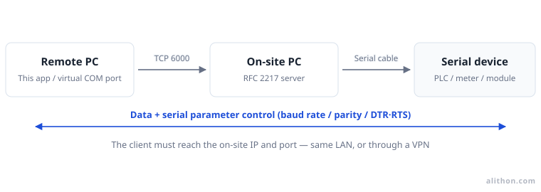

*RFC 2217 — the remote end dials in, and parameters travel with the data, so baud rate, parity
and DTR/RTS stay adjustable from there.*

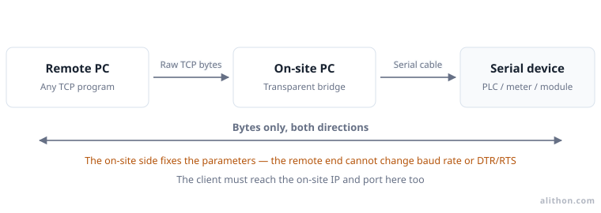

*Transparent forwarding — the same network path, but only bytes cross it; the site fixes the
parameters.*

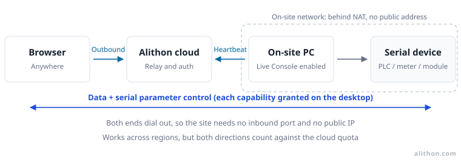

*Live Console — both ends dial out, so a site behind NAT with no public address still works.*

**Live Relay** takes the same route — both ends dial out — but ends in this application rather
than a browser: the far port appears as *Remote Serial (Live Relay)* in the port list and behaves
like a local one, RFC 2217 parameter control included, so XMODEM, Modbus and anything else that
needs a real port run across it unchanged. Live Relay reaches the machines on **your own
account**.

**Live Share** is the same relay opened to somebody who is not on your account at all: mint a
time-limited invite code for one port and send it. The holder joins from Serial Port Utility or
straight from the browser — no registration, no subscription, no bound device — and the traffic
stays on your side.

| | RFC 2217 | Transparent TCP | Live Console | Live Relay | Live Share |
| --- | --- | --- | --- | --- | --- |
| Network requirement | Client reaches the site's IP and port | Client reaches the site's IP and port | Site has Internet access; no inbound port | Both ends have Internet access; no inbound port | Both ends have Internet access; no inbound port |
| Change serial parameters remotely | Yes | No | Yes | Yes | Yes, if the code grants it |
| Drive DTR/RTS remotely | Yes | No | Yes | Yes | Yes, if the code grants it |
| What the client is | This application, an RFC 2217 virtual COM driver, pyserial, device-management software | Any TCP program | A browser | This application | This application or a browser |
| Who the far end has to be | Anyone who can reach the port | Anyone who can reach the port | You, signed in | You, signed in on both machines | Whoever holds the code — no account at all |
| Encryption and authentication | None — relies on the LAN or a VPN | None — relies on the LAN or a VPN | Account sign-in over the cloud link | Account sign-in over the cloud link | The code, an optional passcode, and an expiry |
| Extra cost | None | None | Draws on the cloud traffic quota | Draws on the cloud traffic quota | Draws on the sharer's cloud traffic quota |

Start from one question: **can the client reach the site's IP and port?**

- **No** — behind NAT, no public address, no VPN: go through the cloud. Live Console to watch
  and send from a browser; Live Relay when the far end needs a real port — a file transfer,
  Modbus, or a program that expects a COM port; Live Share when the far end is a colleague or a
  vendor with no account of yours. Forwarding an inbound port just for this exposes a debugging
  machine to the public Internet, which costs far more than it buys.
- **Yes**, and the far end has to set baud rate, parity, stop bits or the control lines: use
  RFC 2217. Both ends have to speak it — one end alone is not enough.
- **Yes**, and the parameters are already fixed on site: use transparent forwarding, where the
  client can be any TCP program.

Two mismatches account for most *it connects but nothing happens* reports: a site bridge left
on **Transparent** while the client dials in as an RFC 2217 client — TCP comes up, but no
parameter ever reaches the port — and a plain TCP socket pointed at an **RFC 2217 server**,
where the negotiation bytes arrive as garbage at the head of the stream.

The five are not exclusive. A common arrangement is RFC 2217 on the LAN day to day and Live
Console or Live Relay while travelling, all over the same physical serial connection. All four
of the ways to open a port to somewhere else — RFC 2217 Server, Live Console, Live Relay and
Live Share — are switched from one **Live Sync** cell in the status bar, which also says, in a word and a colour,
whether a door is standing open and whether somebody is driving one of your ports right now. The
full write-up is [choosing remote access](https://alithon.com/docs/scenarios/remote-access).

### A transparent bridge between any two ports

Forward bytes between any two configured connections — serial ↔ TCP server/client,
serial ↔ UDP, serial ↔ serial, network ↔ network — so SPU acts as a serial device server
while still showing both sides of the traffic. That last part is the point: a hardware gateway
moves the bytes, but you cannot see them.

- **Framing**: immediate, idle gap, delimiter or fixed length.
- **TCP server fan-out**: exclusive, broadcast or frame arbiter, plus an address allowlist
  with CIDR support.
- **RFC 2217** in both roles — see below.
- **Modbus gateway** rewriting frames between TCP and RTU; with frame arbitration several
  masters can share one RS-485 bus.
- Back pressure with a drop counter that stays on screen once it moves, a merged
  bidirectional capture (one time-ordered file with `A->B` / `B->A` markers) and a two-minute
  throughput sparkline.

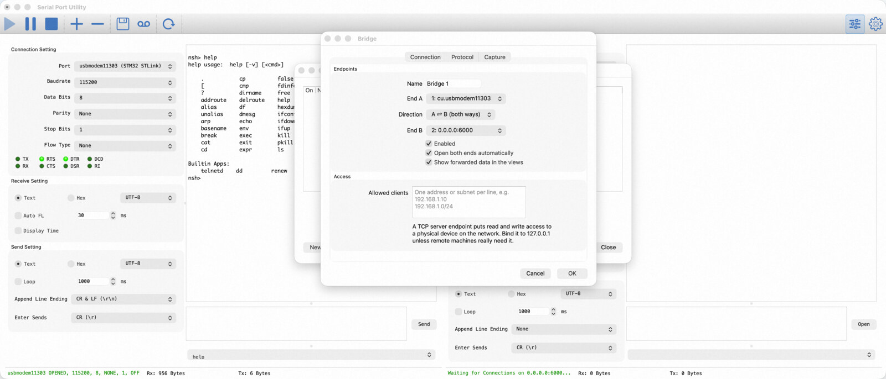

The bridge editor names both ends, the direction and who is allowed to connect; framing, fan-out
and the capture file live on the other two tabs.

Start here: [bridge guides in the help center](https://alithon.com/docs/guides).

### RFC 2217: a serial port that happens to be somewhere else

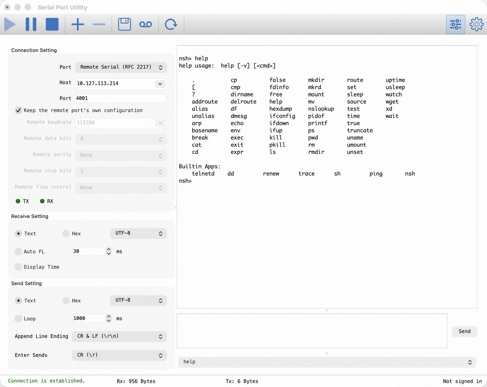

Raw TCP moves the bytes but leaves the port parameters behind: nothing carries the baud rate,
the parity or the state of DTR and RTS. RFC 2217 — Telnet com-port control — is the standard
that carries them, and Serial Port Utility speaks it from **both ends**.

- **Reach a remote port** — pick *Remote Serial (RFC 2217)*, give it the host and port of a
  device server (Moxa NPort, ser2net, another Serial Port Utility), and work with it exactly
  like a local COM port: baud rate, data bits, parity, stop bits, flow control and the DTR/RTS
  lines are set on the far end. No bridge and no virtual COM driver in between.
- **Keep the remote configuration** — one checkbox leaves the device server's own settings
  alone, for a port that is already configured the way the site wants it.
- **Serve a local port** — bridge a serial port to a TCP server with RFC 2217 enabled, and a
  remote RFC 2217 client (pyserial, another Serial Port Utility, a virtual COM port driver)
  can drive your local port's parameters as if it were sitting at your desk.
- **What the far end answers is reported, never silently applied.** A device server that
  clamps 250 000 baud to the nearest rate it can generate says so in the link messages; your
  local port keeps its own settings.
- Parameters are sent once the option is agreed, and after that only what actually changed —
  so a busy link is not filled with renegotiation.

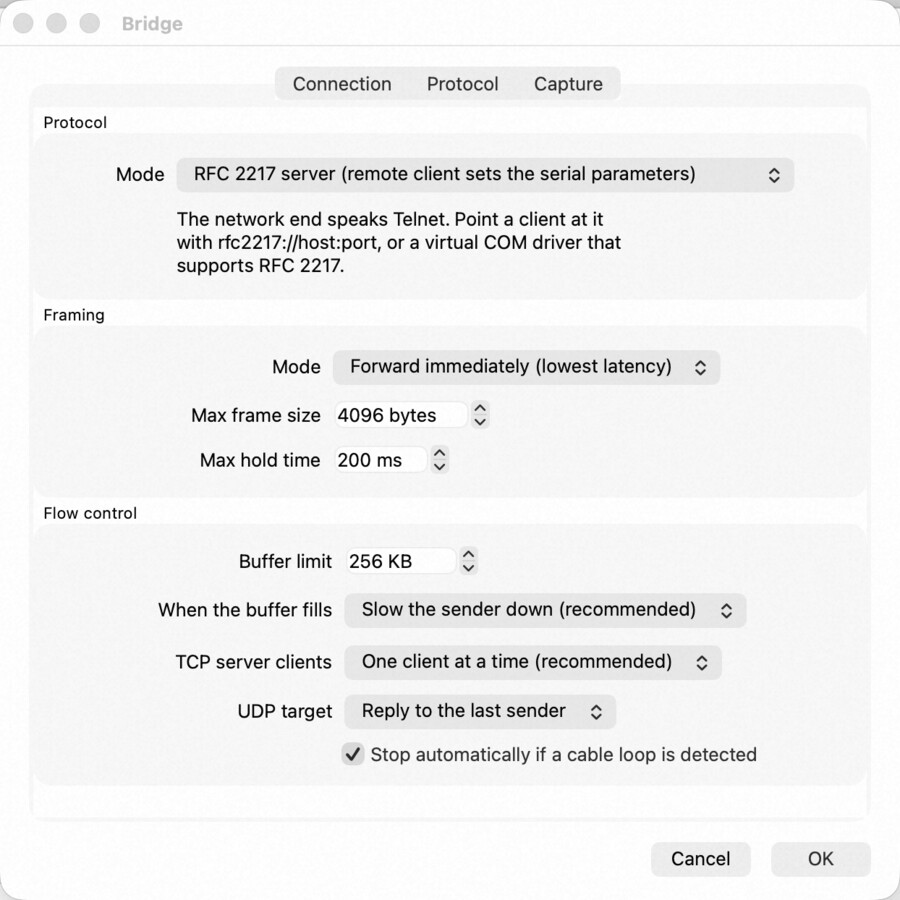

Serving a local port is one dropdown in the bridge's *Protocol* tab — clients then connect with
`rfc2217://host:port`. Step-by-step:
[RFC 2217 server](https://alithon.com/docs/guides/rfc2217-server) ·
[RFC 2217 client](https://alithon.com/docs/guides/rfc2217-client).

### Live Console: the same port, from a browser

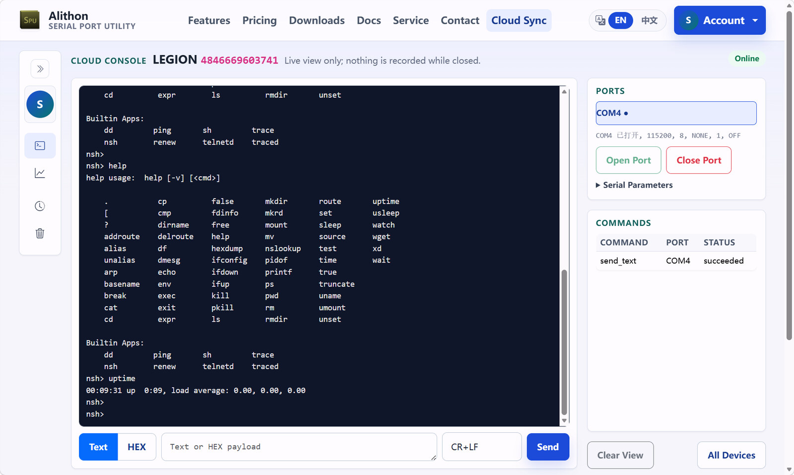

When the site sits behind NAT and there is no VPN, neither of the paths above can be reached
from outside. Live Console solves it from the other direction: the desktop application and the
browser both dial **out** to the cloud, so nothing has to be forwarded into the site.

- **Off by default, and granted on the machine itself** — signing in is not enough. *Live
  Console* puts the device online, *Allow Remote Send* releases sending, *Allow Remote Port
  Control* releases opening, closing and reconfiguring ports, and *Live Relay* lets one
  operator take a port over as a remote serial port. With only the first switch on the console
  is view-only, and the web side cannot bypass any of them.
- **What the browser gets** — the device's ports under the same names as the desktop, the live
  RX log of the selected one, a Text or HEX send box with a line ending, and a command table
  that reports every remote action's state and failure reason.
- **A live window, not a recorder** — nothing is uploaded while nobody is watching, the page
  starts from the moment you open it and the cloud keeps no history. Complete records stay in
  the desktop log files.
- **Real-time by WebSocket** — commands and status ride a live channel, so there is no poll
  interval in the way; a backend that does not offer the gateway keeps working over HTTP
  polling.
- **Metered, not unlimited** — event uploads and remote commands each draw on a monthly cloud
  traffic allowance, with usage and top-ups on the web console.

Details: [Web remote debugging](https://alithon.com/docs/cloud-console) ·
[debugging a port from anywhere](https://alithon.com/docs/scenarios/remote-cloud-console).

### Live Share: hand one port to someone who has no account

Live Relay reaches the machines on your own account, which is no help when the person who
needs the port is a colleague in another company, a vendor's support engineer, or a customer
you are walking through a problem. Live Share is the same relay opened by an **invite code**
instead of by an account.

- **One port, one code, one clock** — *Cloud > Share Port with a Guest…* mints an
  `XXXX-XXXX-XXXX` code and a link for the port you have open, valid for 1, 4, 12 or 24 hours,
  with an optional passcode and a label so you can tell your shares apart.
- **Nothing to install, or everything as usual** — the holder either pastes the code into
  *Remote Serial (Live Relay)* and gets a real port, or opens the link and gets a terminal for
  that one port in the browser. What the browser side may do is set when the code is minted:
  nothing, view only, view and send, or view, send and set the port's parameters.
- **It ends the way you expect** — when the port closes, when Live Console is switched off, on
  sign-out and on exit. Five wrong passcodes burn the code; an expired code admits nobody new
  but never cuts a session in progress. *Cloud > Manage Guest Shares…* lists every live share
  on every machine on your account, with who is on each, and stops any of them.
- **Nobody drives your port in silence** — the status bar says *Shared* while a door stands
  open and *In use* the moment somebody is on the other end, naming the guest when there is
  only one.

### Firmware updates over the wire: XMODEM and YMODEM

A device drops into its bootloader, starts printing `C` once a second, and wants an image sent
to it. Until now that meant reaching for a second terminal program; Serial Port Utility does
it on the connection you already have.

- **Five variants, both directions** — XMODEM (128 bytes, checksum), XMODEM-CRC, XMODEM-1K,
  YMODEM and YMODEM-G, sending and receiving. Most microcontroller bootloaders — ST's AN3155
  and a great many vendor BSPs — speak YMODEM.
- **On any connection that can carry it** — a local serial port, a TCP client, a TCP server,
  or a remote serial port over RFC 2217. UDP is refused rather than half-supported: these
  protocols retransmit by block number and cannot resynchronise after a reordered datagram.
- **Through a device server** — RFC 2217 can set the bootloader's baud rate on the far port
  *and* carry the file over the same connection, so a device in the field can be updated from
  the office. Raw TCP forwarding can move the file but cannot change the remote baud rate.
- **To a device that dialled in** — running as a TCP server, a transfer pins one client and
  leaves every other client sending, receiving and displaying as normal. With several
  connected you pick the one you mean; there is deliberately no "first client" fallback.
- **The transfer owns the port while it runs** — the send box, loop send, terminal keystrokes,
  Break, DTR/RTS and parameter changes are all refused with a reason, because any one of them
  would end an update.
- **Failures name something you can act on** — a wrong baud rate, a device that never asked, a
  disk that filled. An interrupted update says the device may be left with an incomplete
  image, and nothing is ever resumed silently.
- **Received files are handled carefully** — the name the device sends is treated as untrusted
  input, an existing file is never overwritten, and data lands in a temporary file that is
  renamed into place only when the transfer completes.

### Read the bytes the way you need them

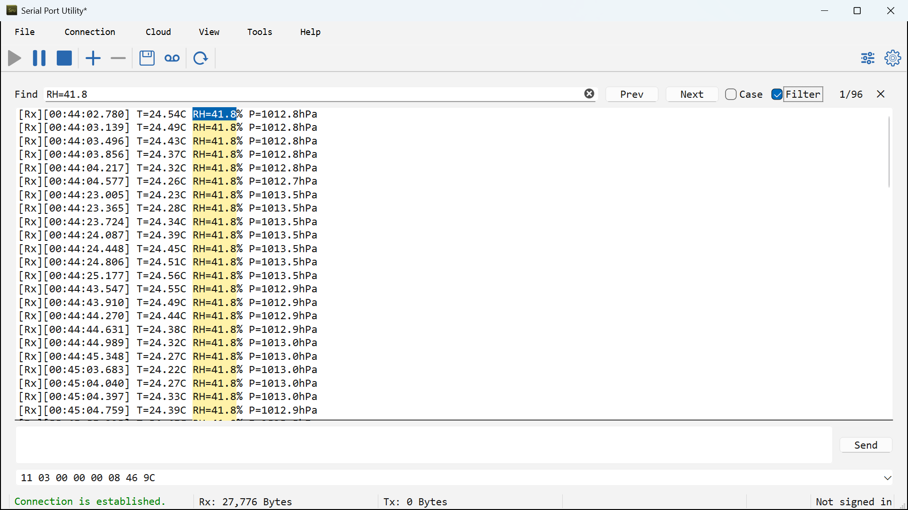

- Text or hex view, switchable per connection at any time.
- Per-connection receive **and** send encodings — UTF-8, GBK, GB18030, Big5, Shift-JIS,
  Latin-1, system codepage and more — so a GBK firmware log reads as text instead of mojibake.
- Millisecond timestamps on every received and sent line, with a configurable format.
- Sent data can be shown inline with the replies, so a command and its answer stay together.
- Local echo in terminal mode: keystrokes appear in the receive view as you type them, so a
  device that never echoes back — common on embedded targets — does not leave you typing
  blind. It is independent of the inline display of sent frames, echoed keys stay out of the
  log, and it is off by default so a device that does echo never doubles every character.
- Auto line feed after a configurable idle gap, keeping packet boundaries readable on a busy
  line.
- Find bar with previous/next, case sensitivity and a filter mode that hides everything except
  matching lines — a live grep over the receive window.
- Pause the display without closing the port; buffered data replays when you resume.

### Send what the device expects

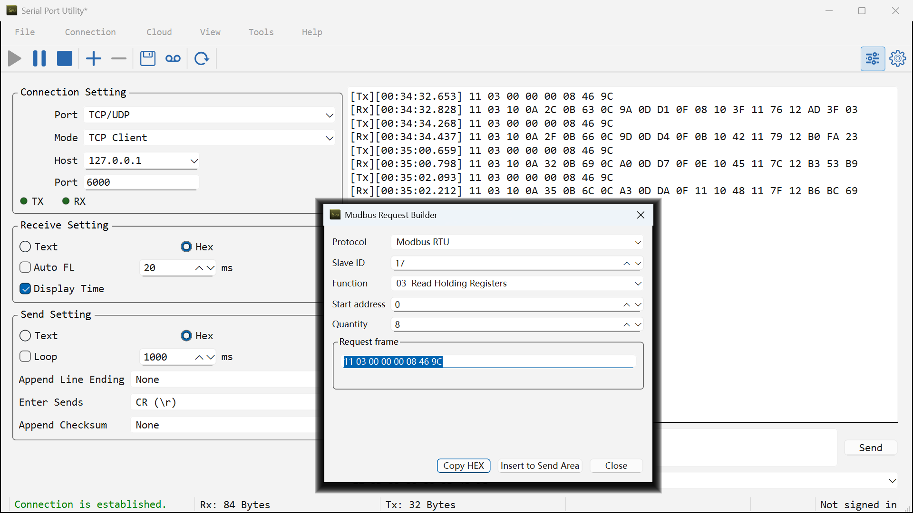

- Send as text or as hex bytes; append CR, LF, CR+LF or nothing, and choose what Enter sends
  in terminal mode.
- Append a checksum automatically: Checksum-8 (SUM), XOR (BCC), CRC-8, CRC-16/MODBUS or
  CRC-32.
- Loop send at a fixed interval for soak tests and polling, with a send history behind the box.
- **Modbus request builder** — RTU or ASCII, slave ID, function (01, 02, 03, 04, 05, 06, 0F,
  10), address and quantity; the complete frame with CRC or LRC is built for you.
- **CRC calculator and converter** — CRC-4/ITU, CRC-5/ITU, CRC-5/USB, CRC-6/ITU, CRC-8,
  CRC-16/MODBUS, CRC-16/USB, CRC-32, or a custom polynomial with width, init, final XOR,
  reflection and wire byte order, which can feed straight into the send frame.
- Text that the selected encoding cannot represent is refused rather than silently replaced,
  and the status bar names the offending character.

### Keep a record

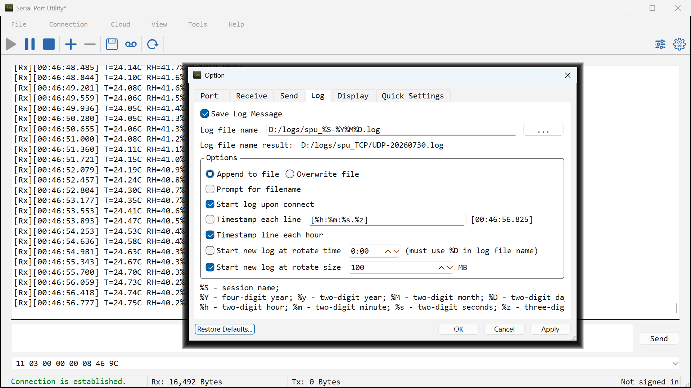

- Log any connection to disk, with file names built from tokens for session name, date and
  time.
- Append or overwrite, start logging automatically on connect, timestamp each line or each
  hour.
- Rotate to a new file at a set time of day, or when the file passes a size limit.
- Save the whole workspace as a `.spu` session file and reopen it later with every port,
  format and display setting in place; the connection that was open at exit is restored on
  the next start.

### Out of the way when you need it to be

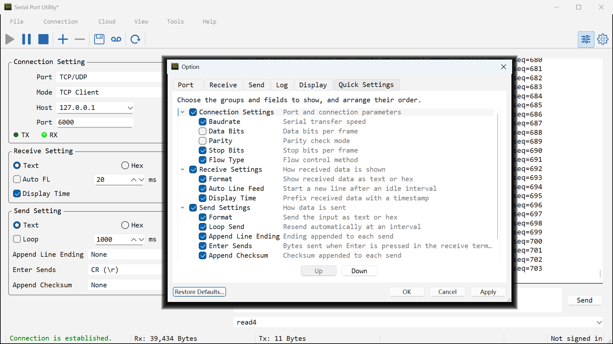

- Quick settings: choose exactly which fields the connection panel shows and in what order,
  hide the TX/RX and control-line indicators, or hide the panel entirely for a data-only
  view.
- The quick settings bar drags down to the width the fields you kept actually need — long
  port names and combo entries elide in place instead of pinning it open.
- Configurable display font, colours and a display buffer of up to hundreds of megabytes.
- Optional cloud sync ties device records, messages, orders and license status together for
  field-service work — and can be left alone entirely if you only want the terminal.
- English and Simplified Chinese interface.

## Typical uses

- Bring-up and debugging of microcontroller firmware over UART.
- Loading firmware into a bootloader with YMODEM or XMODEM, locally or through a device
  server.
- Talking to RS-232 / RS-485 instruments, PLCs, inverters and power meters.
- Modbus RTU and Modbus ASCII register reads and writes, or gatewaying Modbus TCP to RTU.
- Making a serial-only instrument reachable over Ethernet, with the traffic still visible.
- Driving the serial port of a device server (Moxa NPort, ser2net) from your desk over
  RFC 2217, including its baud rate and control lines.
- Watching and driving an on-site port from a browser when the site is behind NAT and there is
  no VPN into it.
- Sitting between a host application and a device to watch both halves of the conversation.
- GNSS receivers, modems and AT-command devices.
- Capturing a long-running device log for later analysis.
- Bench testing against a TCP or UDP endpoint instead of physical hardware.

<details>
<summary><b>More screenshots</b></summary>

Full serial parameters for any COM port — baud rate, data bits, parity, stop bits, flow
control and the DTR/RTS control lines:

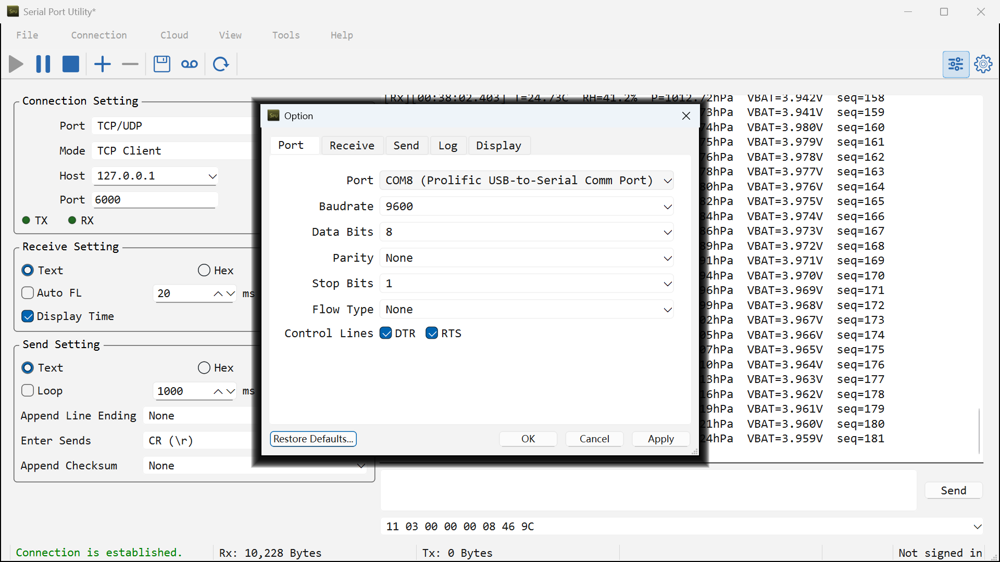

The Send page of the settings dialog — encoding, loop, line ending, what Enter sends, Display
Send, Local Echo and the appended checksum:

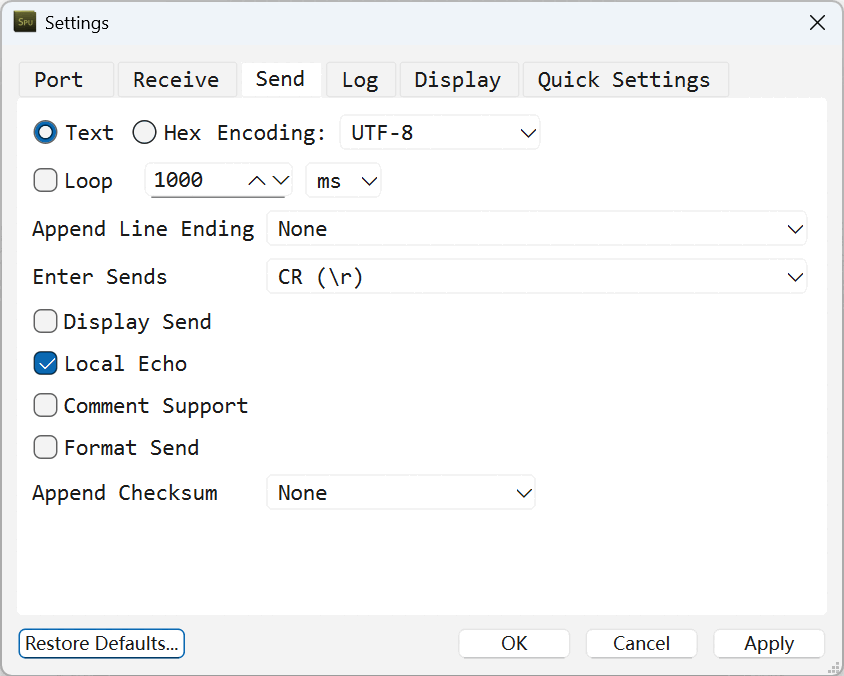

The CRC calculator, with the standard families and a fully custom polynomial:

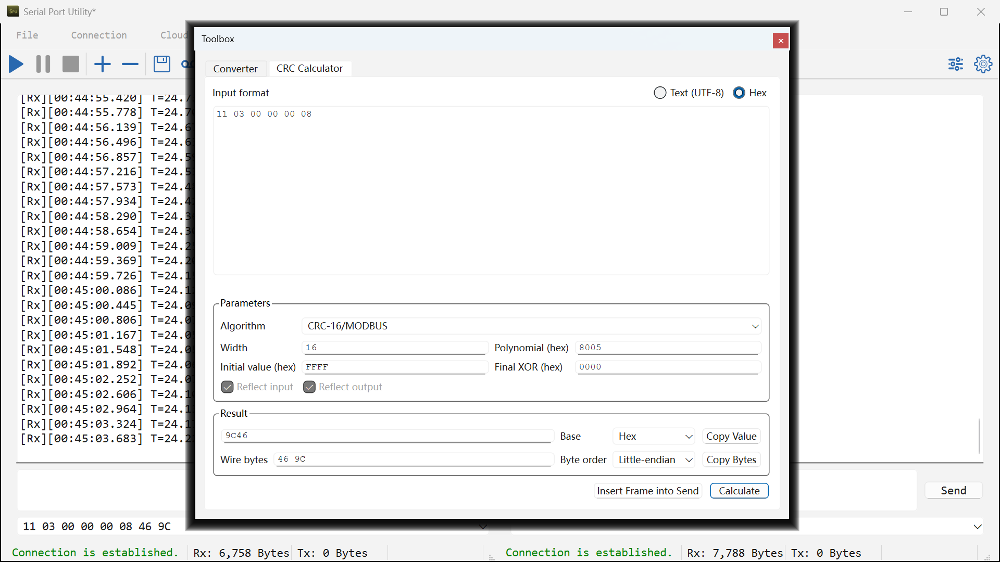

</details>

## Licensing

Serial Port Utility is commercial software with a **30-day free trial** — no account needed to
try it. After the trial, personal and enterprise licenses are available with 1-month, 1-year,
3-year and lifetime terms.

A license can be **bound to your Alithon account**: tick the box at checkout (or in License
Management on a machine that already has a key) and signing in activates whatever computer you
are on, while signing out releases it again. A key that is not bound runs on up to **three
machines at once**, and deactivating one gives the slot straight back — there is no transfer
count to use up. A key binds to one account and cannot be moved afterwards, so every place that
offers it says so first.

The remote-access features above are available on **every edition**, including a free one. What
a paid entitlement changes is the monthly cloud traffic allowance the Live Console, Live Relay
and Live Share paths draw on.

- [Pricing](https://alithon.com/pricing) · [Buy](https://alithon.com/regnow) ·
  [Look up an order](https://alithon.com/order/query) ·
  [Offline activation](https://alithon.com/offline_activate)
- [Terms of Service](https://alithon.com/terms) · [Refund Policy](https://alithon.com/refunds) ·
  [Privacy Policy](https://alithon.com/privacy)

The binaries published here are licensed, not sold; see [LICENSE.md](LICENSE.md).

## About this repository

This repository is the **official release channel** for Serial Port Utility. It carries the
published packages and this documentation — the application source code is not public.

Each release is built and tested on GitHub Actions for all three platforms, published here,
and then picked up automatically by [alithon.com/downloads](https://alithon.com/downloads).
So a version on the [Releases page](https://github.com/alithon/serial-port-utility/releases)
is the same build the website serves, and the release notes here are the changelog.

Watch this repository (**Watch → Custom → Releases**) to be notified when a new version ships.

## Support

- **Documentation and guides** — [alithon.com/docs](https://alithon.com/docs), including
  [getting started](https://alithon.com/docs/getting-started),
  [task guides](https://alithon.com/docs/guides) and
  [troubleshooting](https://alithon.com/docs/troubleshooting).
- **Bug reports and feature requests** —
  [open an issue](https://github.com/alithon/serial-port-utility/issues/new/choose).
  Please include your version, platform and what the device was doing.
- **Orders, licenses and anything private** — <bill@alithon.com> or the
  [contact form](https://alithon.com/contact).
- **Security reports** — see [SECURITY.md](SECURITY.md).

More on how to reach us: [SUPPORT.md](SUPPORT.md).

## Links

| | |
| --- | --- |
| Website | [alithon.com](https://alithon.com) |
| Features | [alithon.com/features](https://alithon.com/features) |
| Downloads (with checksums) | [alithon.com/downloads](https://alithon.com/downloads) |
| Help center | [alithon.com/docs](https://alithon.com/docs) |
| Release history | [alithon.com/changelog](https://alithon.com/changelog) |
| Contact | [alithon.com/contact](https://alithon.com/contact) |

---

<div align="center">

Copyright © 2026 Alithon Studio. All rights reserved.

</div>
