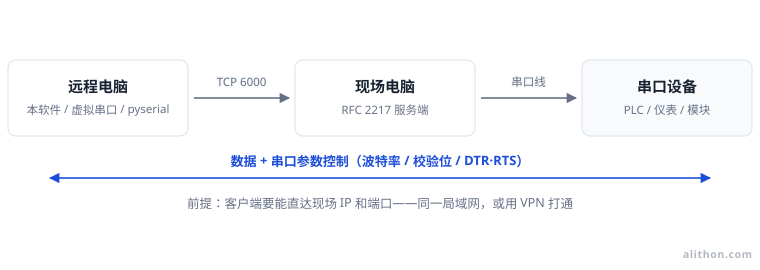
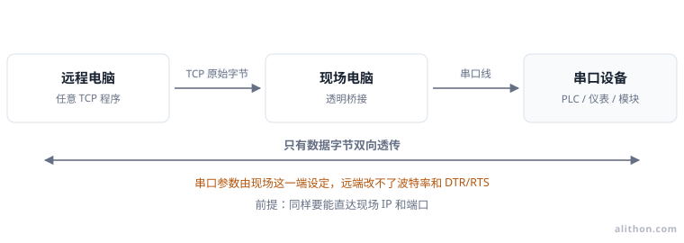
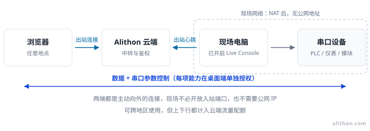
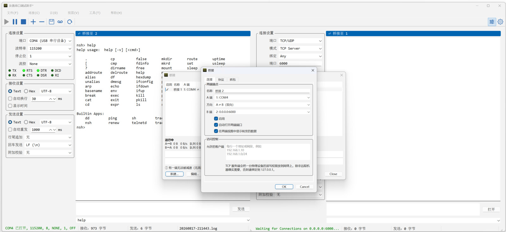
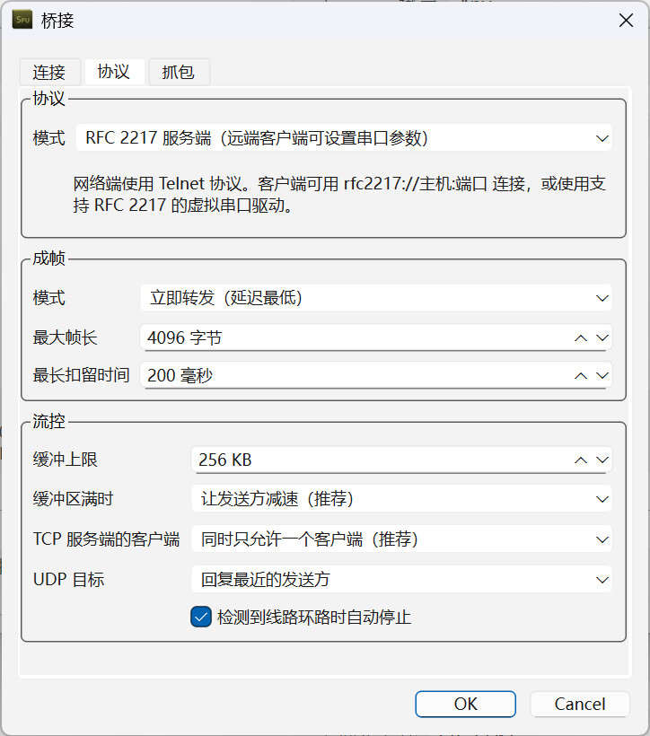
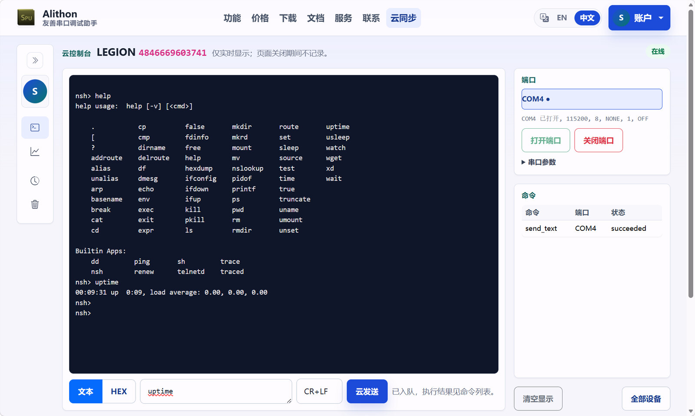
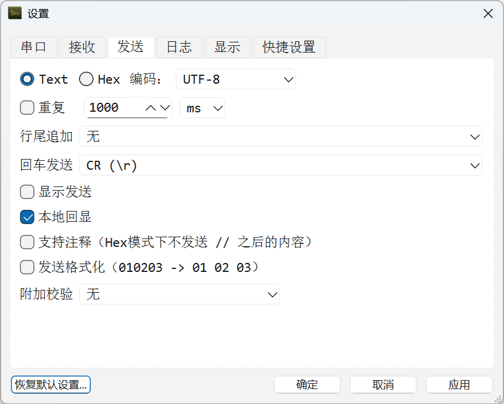

<div align="center">


# 友善串口调试助手 Serial Port Utility

**串口、TCP、UDP 同窗调试，最多 16 路；任意两个连接之间还能透明桥接。**

[](https://github.com/alithon/serial-port-utility/releases/latest)
[](https://github.com/alithon/serial-port-utility/releases)
[](#下载)
[](https://alithon.com)

[下载](https://github.com/alithon/serial-port-utility/releases/latest) ·
[使用文档](https://alithon.com/docs) ·
[更新日志](https://github.com/alithon/serial-port-utility/releases) ·
[官网](https://alithon.com) ·
[English](README.md)

</div>


## 这是什么

友善串口调试助手（Serial Port Utility，简称 SPU）是一款面向固件、嵌入式、物联网与工业现场
工程师的桌面调试终端：打开端口，看清设备到底发出了什么，把命令或原始帧发回去，并把整个过程
带时间戳记录下来。

它是 [Alithon Studio](https://alithon.com) 的商业软件，支持 Windows、macOS 与 Linux，
提供 30 天免费试用。**本仓库是它的官方发布源** —— 详见[关于本仓库](#关于本仓库)。

与普通串口终端相比：

- **一个窗口装下整台工作台。** 串口、TCP 客户端/服务端、UDP 客户端/服务端并排显示，
  最多 16 路，每一路都有自己的显示格式、文本编码、时间戳与日志文件。
- **不只是"看"，还能"转"。** 任意两个连接之间转发数据，让只有串口的设备被网络访问，
  *而且转发的同时双向报文照常显示*。
- **协议调试是内建能力。** Modbus RTU/ASCII 请求构建器、可自动附加到发送帧的 CRC 校验库、
  RFC 2217 以及 Modbus TCP ⇄ RTU 网关。
- **会话可以存下来。** 整个工作区保存为 `.spu` 工程文件，明天打开就是今天离开时的样子。

## 下载

| 平台 | 安装包 | 运行要求 |
| --- | --- | --- |
| **Windows** | `serial_port_utility_<版本>_<MMdd>.exe`（安装程序） | Windows 10 1809（内部版本 17763）及以上，64 位 |
| **macOS** | `SerialPortUtility-v<版本>.dmg` | macOS 12 Monterey 及以上，**Apple 芯片** |
| **Linux** | `serial-port-utility-v<版本>-linux-x86_64.tar.gz` | x86_64，glibc 2.35+（Ubuntu 22.04 及以上），需 Qt 6.8 运行库 |

**[⬇ 获取最新版本](https://github.com/alithon/serial-port-utility/releases/latest)**

官网 [alithon.com/downloads](https://alithon.com/downloads) 同样提供下载，并列出每个安装包的
SHA-256 —— 无论从哪里下载，都建议核对一次。

<details>
<summary><b>各平台安装说明</b></summary>

**Windows** —— 运行安装程序按提示完成即可。覆盖安装不会影响已有设置与授权。

**macOS** —— 这里发布的 `.dmg` 未经 Apple 公证，首次启动会被系统拦下。可在
**系统设置 → 隐私与安全性** 中选择"仍要打开"，或自行清除隔离属性：

```bash
xattr -dr com.apple.quarantine /Applications/SerialPortUtility.app
```

**Linux** —— 压缩包内是动态链接的可执行文件，需先安装 Qt 6.8 运行库
（Qt Widgets、Network、SerialPort、Core5Compat）。Debian / Ubuntu 上：

```bash
sudo apt install qt6-base-dev qt6-serialport-dev qt6-5compat-dev
tar xzf serial-port-utility-*-linux-x86_64.tar.gz
./SerialPortUtility
```

访问串口通常还需要加入 `dialout` 用户组：`sudo usermod -aG dialout $USER`（重新登录生效）。

</details>

## 功能一览

### 串口、TCP、UDP 并排调试


- 任意 COM 口：板载串口、USB 转串口（FTDI、Prolific、CH340、CP210x……）与虚拟串口。
- 标准波特率之外还可填任意自定义速率（上限只取决于硬件）；5/6/7/8 数据位；
  无/偶/奇/标记/空格校验；1/1.5/2 停止位；无、RTS/CTS 或 XON/XOFF 流控。
- 串口开着时改这些参数立即就地生效，不关不重开——DTR 不会掉，对端的开发板也不会被顺手复位。
- TX/RX 与控制线指示灯（RTS、CTS、DTR、DSR、DCD、RI）随真实收发闪烁，DTR 与 RTS 可手动翻转。
- TCP 客户端、TCP 服务端（多客户端接入）、UDP 客户端与 UDP 服务端，用于网络设备、
  串口服务器与模拟器。
- 单窗口最多 16 路连接，可横排、竖排或网格排列；连接之间的边界还能拖动，
  数据多的那一路可以分到更大空间。
- 断线后自动重连。

### 远程操作一个不在手边的串口，有五条路

远程调试从来不是一个问题。选错了，代价通常是"连得上但改不了参数"，或者"网络根本不通"。
这五条路本软件都提供，区别在三处：**连接由哪一端发起**、**串口参数会不会跟着数据一起过去**，
以及**对面那台机器需要装什么**。



*RFC 2217 —— 连接由远端发起，参数跟着数据一起过去，波特率、校验位与 DTR/RTS 都能在远端改。*



*透明 TCP 转发 —— 网络路径和 RFC 2217 一样，但过去的只有数据字节，参数由现场那端定死。*



*实时终端 —— 两端都向云端出站，所以现场在 NAT 后面、没有公网地址也能用。*

**实时中继（Live Relay）**走同一条路 —— 两端都向云端出站 —— 但终点是本软件而不是浏览器：
远端串口以「远端串口 (实时中继)」出现在端口列表里，用起来和本地串口一样，RFC 2217 参数控制照常，
XMODEM、Modbus 以及任何需要一个真实串口的程序都能不加改动地跑在上面。实时中继连的是
**你自己账户名下**的机器。

**实时分享（Live Share）**把同一条中继开给一个根本不在你账户里的人：为某个串口签发一张
有时限的邀请码发过去，拿到码的人用本软件加入，或者直接在浏览器里打开 —— 不必注册、不必订阅、
不必绑定设备 —— 流量记在分享方。

| | RFC 2217 | 透明 TCP 转发 | 实时终端 | 实时中继 | 实时分享 |
| --- | --- | --- | --- | --- | --- |
| 网络前提 | 客户端能直达现场 IP 和端口 | 客户端能直达现场 IP 和端口 | 现场能上网即可，无需入站端口 | 两端能上网即可，无需入站端口 | 两端能上网即可，无需入站端口 |
| 远程修改串口参数 | 可以 | 不可以 | 可以 | 可以 | 邀请码放开就可以 |
| 远程控制 DTR/RTS | 可以 | 不可以 | 可以 | 可以 | 邀请码放开就可以 |
| 客户端是什么 | 本软件、支持 RFC 2217 的虚拟串口、pyserial、设备管理软件 | 任意 TCP 程序 | 浏览器 | 本软件 | 本软件或浏览器 |
| 对面必须是谁 | 任何能连到这个口的人 | 任何能连到这个口的人 | 你本人，且已登录 | 你本人，两台机器都已登录 | 拿着邀请码的人，不需要任何账号 |
| 加密与认证 | 无，依赖局域网或 VPN | 无，依赖局域网或 VPN | 有，走账号与云端链路 | 有，走账号与云端链路 | 邀请码、可选口令与有效期 |
| 额外成本 | 无 | 无 | 占用云端流量配额 | 占用云端流量配额 | 占用分享方的云端流量配额 |

先回答一个问题：**客户端能不能直接访问现场的 IP 和端口？**

- **不能** —— 现场在 NAT 后面、没有公网地址也没有 VPN：走云端。只是看和发，用实时终端；
  远端需要一个真实串口 —— 传文件、跑 Modbus、给只认 COM 口的程序用 —— 就用实时中继；
  对面是外部同事或供应商、没有你的账号，就用实时分享。
  为此做端口映射，等于把一台调试机暴露到公网，代价远大于收益。
- **能**，而且远端需要改波特率、校验位、停止位或控制线：用 RFC 2217，两端都必须支持，
  只有一端是不行的。
- **能**，参数在现场也早已定好：用透明转发，客户端可以是任意 TCP 程序。

大部分"连上了却什么都没发生"都出自两种错配：现场桥接留在**透明转发**，客户端却按
RFC 2217 连接 —— TCP 建立得起来，但参数一条也下发不到端口；以及用普通 TCP Socket 去连
**RFC 2217 服务端** —— 协商字节混进数据流，表现为开头几个字节是乱码。

五者并不互斥，常见做法是日常在局域网内用 RFC 2217，出差时用实时终端或实时中继，
共用同一个物理串口连接。把串口开给别处的四种方式 —— RFC 2217 服务器、实时终端、实时中继、
实时分享 —— 都收在状态栏的一个 **Live Sync**（实时同步）格子里，它同时用一个词和一种颜色
说明：门是不是开着，以及此刻有没有人正在驱动你的串口。完整的选型说明见
[远程方案选型](https://alithon.com/docs/scenarios/remote-access)。

### 任意两个端口之间的透明桥接

在任意两个已配置的连接之间转发数据 —— 串口↔TCP 服务端/客户端、串口↔UDP、串口↔串口、
网络↔网络 —— 让 SPU 直接充当串口服务器，同时照常显示两端报文。最后半句才是关键：
硬件网关能把字节转过去，但你看不见它们。

- **帧划分**：立即、空闲间隔、分隔符或定长。
- **TCP 服务端扇出**：独占、广播或帧仲裁，并支持地址白名单（含 CIDR）。
- **RFC 2217**：两个方向都支持，见下一节。
- **Modbus 网关**：在 TCP 与 RTU 之间改写帧；配合帧仲裁，多个主站可共用一条 RS-485 总线。
- 带背压控制与丢包计数（一旦发生即以红色常驻显示）、双向合并抓包
  （单个按时间排序、带 `A->B` / `B->A` 标记的文件）以及两分钟吞吐曲线。



桥接编辑器负责指定两端、方向与允许接入的地址；成帧、扇出与抓包在另外两个标签页里。

上手可从帮助中心的[桥接相关指南](https://alithon.com/docs/guides)开始。

### RFC 2217：一个恰好不在本地的串口


裸 TCP 只搬字节，把串口参数丢在了另一头：波特率、校验位、DTR/RTS 的状态，一个都传不过去。
RFC 2217（Telnet 串口控制）就是补上这段的标准，而友善串口调试助手**两端都能扮演**。

- **直连远端串口** —— 端口选择「远端串口（RFC 2217）」，填上串口服务器
  （Moxa NPort、ser2net、另一台 SPU）的地址和端口，之后就像用本地 COM 口一样使用它：
  波特率、数据位、校验、停止位、流控以及 DTR/RTS 都设置到远端那根串口上。
  中间不需要桥接，也不需要虚拟串口驱动。
- **沿用远端现有配置** —— 一个勾选框即可保持串口服务器上已有的设置不动，
  适合那些现场早已配好的端口。
- **把本地串口交出去** —— 把串口桥接到启用了 RFC 2217 的 TCP 服务端，
  远端的 RFC 2217 客户端（pyserial、另一台 SPU、虚拟串口驱动）就能像坐在你桌前一样，
  设置你这台机器上的串口参数。
- **远端的回执只记录、不反向生效。** 串口服务器把 250000 波特夹到它能生成的最近档位时，
  会在链路消息中说明，而本机串口的设置不受影响。
- 协商成功后参数一次性下发，之后只补发真正变化的项 —— 繁忙链路不会被反复协商塞满。



把本地串口交出去，只是桥接「协议」页里的一个下拉项，客户端随后用 `rfc2217://host:port` 连入。
分步说明见 [RFC 2217 服务端](https://alithon.com/docs/guides/rfc2217-server) ·
[RFC 2217 客户端](https://alithon.com/docs/guides/rfc2217-client)。

### 实时终端（Live Console）：同一个串口，从浏览器操作



现场在 NAT 后面、又没有 VPN 时，上面两条路从外面根本够不着。实时终端换了个方向解决：
桌面端与浏览器都**主动向云端出站**，现场不需要开放任何入站端口。

- **默认全关，且只能在设备本机上授权** —— 登录并不等于放开。「实时终端」让设备上线，
  「允许远程发送」才放开发送，「允许远程端口控制」才放开开关端口与改参数，
  「实时中继」才允许一位操作者把串口整个接管为远端串口；
  只开第一项时终端是只读的，网页端绕不过这些开关。
- **浏览器里能看到什么** —— 设备的端口列表（名称与桌面端一致）、所选端口的实时接收日志、
  文本或 HEX 发送框（可选行尾），以及一张命令表，逐条显示远程操作的状态与失败原因。
- **是实时窗口，不是录像机** —— 没人看的时候不上传，页面只显示打开之后的数据，云端不留历史。
  完整记录仍然在桌面端的日志文件里。
- **WebSocket 实时通道** —— 命令与状态走实时通道，没有轮询间隔带来的延迟；
  服务端未提供该通道时自动改用 HTTP 轮询。
- **计量而非无限** —— 事件上行与远程命令下行分别计入每月云端流量额度，用量与充值在网页端查看。

详见 [Web 远程调试](https://alithon.com/docs/cloud-console) ·
[随时随地通过 Web 调试串口](https://alithon.com/docs/scenarios/remote-cloud-console)。

### 实时分享（Live Share）：把一个串口交给没有账号的人

实时中继连的是你自己账户名下的机器，可真正需要这个串口的人往往是另一家公司的同事、
供应商的支持工程师，或者一位你正在电话里带着排查的客户。实时分享就是同一条中继，
只不过由一张**邀请码**打开，而不是由账号打开。

- **一个口、一张码、一段时间** —— 「云 > 分享串口给访客…」为当前打开的串口签发一张
  `XXXX-XXXX-XXXX` 邀请码和一条链接，有效期 1／4／12／24 小时可选，可以加口令，
  也可以写一句标签，方便自己分辨。
- **对面不用装任何东西，也可以照常用本软件** —— 拿到码的人要么在「远端串口 (实时中继)」里
  粘贴邀请码、得到一个真实串口，要么直接打开链接，在浏览器里得到一个只属于这个口的终端。
  浏览器那一侧能做什么在签发时就定好：不开放、只看、看并发送，或者看、发送并可改串口参数。
- **该结束的时候就结束** —— 串口关闭、实时终端关闭、退出登录或程序退出，分享随之结束；
  口令连续错 5 次就烧掉这张码；到期的码不再接受新的加入，但不会切断正在进行的会话。
  「云 > 管理访客分享…」列出账户名下每台机器上仍然有效的分享、每张码上有谁，可以随时停掉任意一个。
- **没有人能悄悄用你的串口** —— 门开着的时候状态栏写**已分享**，一旦有人接进来就变成
  **使用中**；只有一位时直接写出是谁。

### 隔着线缆升级固件：XMODEM 与 YMODEM

设备进入 bootloader，每秒吐一个 `C`，等着你把镜像送进去。以前这一步得再装一个终端软件，
现在友善串口调试助手在你已有的连接上就能做完。

- **五种协议，收发双向** —— XMODEM（128 字节，累加和）、XMODEM-CRC、XMODEM-1K、YMODEM
  和 YMODEM-G。绝大多数 MCU bootloader —— ST 官方 AN3155 以及大量国产 BSP —— 只认 YMODEM。
- **凡是扛得住的连接都能传** —— 本地串口、TCP 客户端、TCP 服务端，以及经 RFC 2217 的
  远端串口。UDP 明确拒绝而不是勉强支持：这两个协议靠块号重传，数据报一旦乱序就无法重新同步。
- **隔着串口服务器也能升级** —— RFC 2217 既能把远端串口切到 bootloader 的波特率，
  又能在同一条连接上把文件传过去，办公室里就能升级现场设备。裸 TCP 转发搬得动文件，
  却改不了远端的波特率。
- **对主动连入的设备传输** —— 作为 TCP 服务端时，传输会钉住一个客户端，
  其余客户端照常收发、照常显示。连了多个时由你指定，刻意没有「默认第一个」的回退。
- **传输期间独占端口** —— 发送框、循环发送、终端键盘、Break、DTR/RTS 和参数修改
  都会被拒绝并说明原因，因为它们中任何一个都足以终结一次升级。
- **失败信息指向你能动手做的事** —— 波特率不对、设备根本没请求、磁盘写满。
  升级中断时会明确提示设备可能停留在不完整的固件上，绝不静默续传。
- **收到的文件被谨慎对待** —— 设备给出的文件名按不可信输入处理，
  已存在的文件绝不覆盖，数据先落到临时文件，传输完成才改名就位。

### 按你需要的方式看数据


- 文本或十六进制显示，每路连接随时切换。
- 接收与发送编码逐连接单独设置 —— UTF-8、GBK、GB18030、Big5、Shift-JIS、Latin-1、
  系统编码等 —— GBK 的固件日志不再是一屏乱码。
- 每行收发都带毫秒级时间戳，时间格式可配置。
- 发送内容可与回复交错显示，一条命令和它的应答不会被分开。
- 终端模式下可开启本地回显：敲下的字符按输入顺序在接收区原位显示，
  对着不回显的嵌入式设备不再是盲打。它与发送内容的交错显示相互独立，回显的按键不写入日志；
  默认关闭，避免设备自身回显时每个字符出现两遍。
- 空闲超过设定间隔自动换行，线路繁忙时包边界依然清晰。
- 查找栏支持上一个/下一个、区分大小写，以及只显示匹配行的过滤模式 ——
  相当于对接收窗口做实时 grep。
- 可暂停显示而不关闭端口，恢复时缓存的数据会补上，不丢数据。

### 发出设备真正认识的字节


- 按文本或十六进制发送；可追加 CR、LF、CR+LF 或不追加；终端模式下回车发什么也能自定义。
- 自动附加校验：Checksum-8（SUM）、异或（BCC）、CRC-8、CRC-16/MODBUS、CRC-32。
- 定时循环发送，适合老化测试与轮询；发送框后面还有历史记录。
- **Modbus 请求构建器** —— 选择 RTU 或 ASCII、从站地址、功能码（01、02、03、04、05、06、
  0F、10）、寄存器地址与数量，带 CRC 或 LRC 的完整帧自动生成。
- **CRC 计算器与数据转换** —— CRC-4/ITU、CRC-5/ITU、CRC-5/USB、CRC-6/ITU、CRC-8、
  CRC-16/MODBUS、CRC-16/USB、CRC-32，也可自定义多项式（位宽、初值、结果异或、反转、
  线上字节序），结果可直接接入发送帧。
- 当前编码无法表示的字符不会被悄悄替换成 `?` 发出去，而是拒绝该帧并在状态栏指出是哪个字符。

### 留下可追溯的记录


- 任意连接均可记录到磁盘，文件名可由会话名、日期、时间等占位符拼出。
- 追加或覆盖、连接时自动开始记录、按行或按小时打时间戳。
- 到指定时刻或文件超过设定大小时自动切换到新文件。
- 整个工作区保存为 `.spu` 会话文件，重新打开时端口、格式与显示设置原样恢复；
  退出时打开着的连接，下次启动会自动恢复。

### 需要时安静地待在一边


- 快捷设置：自定义连接面板显示哪些字段、按什么顺序，可隐藏 TX/RX 与控制线指示灯，
  也可以整块隐藏，只留数据视图。
- 快捷设置栏可以拖到所留字段真正需要的宽度：过长的端口名与下拉条目在原地省略
  （展开列表仍显示完整内容），不再把整条栏撑开。
- 显示字体、颜色可配置，显示缓冲区最大可达数百 MB。
- 可选的云同步把设备记录、消息、订单与授权状态串起来，服务于现场交付；
  只想要一个终端的话，完全不用碰它。
- 界面支持简体中文与英文。

## 典型用途

- 单片机固件通过 UART 的调试与上电排查。
- 用 YMODEM 或 XMODEM 把固件送进 bootloader，本地或隔着串口服务器都可以。
- 与 RS-232 / RS-485 仪表、PLC、变频器、电表对话。
- Modbus RTU / ASCII 寄存器读写，或把 Modbus TCP 网关到 RTU。
- 让只有串口的仪器被以太网访问，并且报文全程可见。
- 通过 RFC 2217 在办公桌前直接操作串口服务器（Moxa NPort、ser2net）上的串口，
  连波特率与控制线一并设置。
- 现场在 NAT 后面又没有 VPN 时，从浏览器盯住并操作现场那个串口。
- 坐在上位机与设备中间，看清双向对话（串口对串口嗅探）。
- GNSS 接收机、模组与 AT 指令设备。
- 长时间采集设备日志以便事后分析。
- 没有真机时，先对着 TCP / UDP 端点做台架测试。

<details>
<summary><b>更多截图</b></summary>

任意 COM 口的完整串口参数 —— 波特率、数据位、校验位、停止位、流控与 DTR/RTS 控制线：


设置对话框的「发送」页 —— 编码、循环、行尾追加、回车发送、显示发送、本地回显与附加校验：



CRC 计算器，涵盖常用算法族与完全自定义的多项式：


</details>

## 授权与购买

友善串口调试助手是商业软件，提供 **30 天免费试用**，试用无需注册账号。试用期结束后可购买
个人版或企业版授权，支持 1 个月、1 年、3 年与永久多种期限。

授权可以**绑定到你的 Alithon 账户**：结账时勾选（或在已装好密钥的机器上于「许可证管理」里勾选），
之后用该账户登录，你所在的那台电脑就自动激活，退出登录时自动释放。未绑定的密钥最多可
**同时**用于三台机器，停用其中一台即刻释放名额，没有会被用光的转移次数。一个密钥只能绑定
一个账户且之后无法更改，因此每个入口都会先说明。

上面这些远程能力**所有版本都能用**，包括免费版。付费授权改变的只是实时终端、实时中继与
实时分享每月可用的云端流量额度。

- [价格](https://alithon.com/pricing) · [购买](https://alithon.com/regnow) ·
  [订单查询](https://alithon.com/order/query) ·
  [离线激活](https://alithon.com/offline_activate)
- [服务条款](https://alithon.com/terms) · [退款政策](https://alithon.com/refunds) ·
  [隐私政策](https://alithon.com/privacy)

本仓库发布的程序为授权使用而非出售，详见 [LICENSE.md](LICENSE.md)。

## 关于本仓库

本仓库是友善串口调试助手的**官方发布渠道**，只存放已发布的安装包与这些说明文档 ——
应用程序源码不公开。

每个版本都由 GitHub Actions 在三个平台上构建并跑完测试，发布到这里，
再由 [alithon.com/downloads](https://alithon.com/downloads) 自动同步。因此
[Releases 页面](https://github.com/alithon/serial-port-utility/releases)上的版本
与官网提供的是同一份构建产物，这里的发布说明就是更新日志。

想第一时间收到新版本通知，可以 Watch 本仓库（**Watch → Custom → Releases**）。

## 获取支持

- **文档与指南** —— [alithon.com/docs](https://alithon.com/docs)，
  包括[快速上手](https://alithon.com/docs/getting-started)、
  [任务指南](https://alithon.com/docs/guides)与[故障排查](https://alithon.com/docs/troubleshooting)。
- **问题反馈与功能建议** ——
  [提交 Issue](https://github.com/alithon/serial-port-utility/issues/new/choose)，
  请附上版本号、操作系统以及设备当时在做什么。
- **订单、授权及其它不便公开的问题** —— <bill@alithon.com> 或
  [联系表单](https://alithon.com/contact)。
- **安全问题** —— 见 [SECURITY.md](SECURITY.md)。

更多联系方式见 [SUPPORT.md](SUPPORT.md)。

## 相关链接

| | |
| --- | --- |
| 官网 | [alithon.com](https://alithon.com) |
| 功能介绍 | [alithon.com/features](https://alithon.com/features) |
| 下载（含校验值） | [alithon.com/downloads](https://alithon.com/downloads) |
| 帮助中心 | [alithon.com/docs](https://alithon.com/docs) |
| 版本历史 | [alithon.com/changelog](https://alithon.com/changelog) |
| 联系我们 | [alithon.com/contact](https://alithon.com/contact) |

---

<div align="center">

Copyright © 2026 Alithon Studio. 保留所有权利。

</div>
